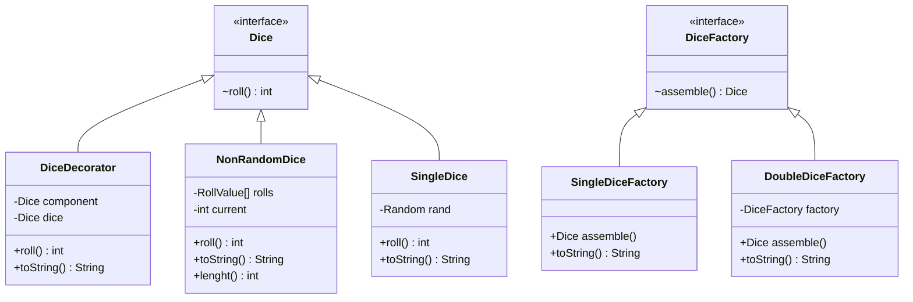
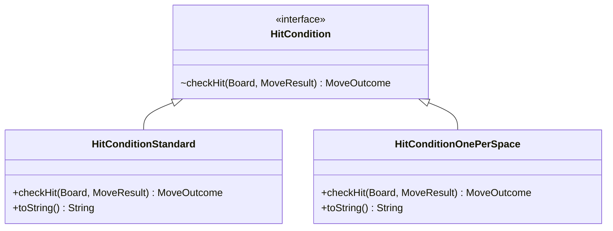
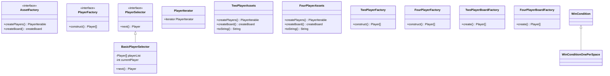

Frustration Game
=================
***Software Design And Architecture***

**Author:** *Luke Cadman*

I am Going to Caveat this by stating i am NOT going to be doing complete UML diagrams for any OOP 
principles. Other than Inheritance and others in certain cases because otherwise it becomes ugly and the UML diagrams start to 
mean less; just become a mess of lines and are harder to interpret.

# Dice Variation

Dice Variations talk about value object and null pattern

---------------
# Hit Variation

talk about use of move outcome to simplfy response put in sample

---------------
# Win Variation

How Similar Designed to Above class just with different outcome
and show how commands are used in outcome to deal with resets
and how use of tostring overrides allows for simple file and console output

---------------
# 4 Player Variation

Trying to find somewhere to put an abstract factory as these depedned on each other worked well
Use of iterator as well in main game loop to allow for cleaner rotation of player which is more expandabkle in future SRP
---------------
State Machine
File Output
Solid
Ports and A
Implemntation
