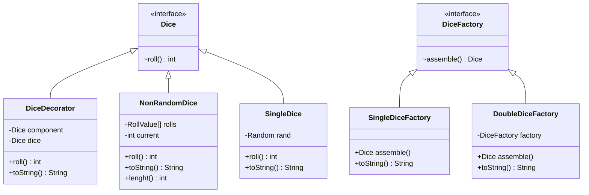
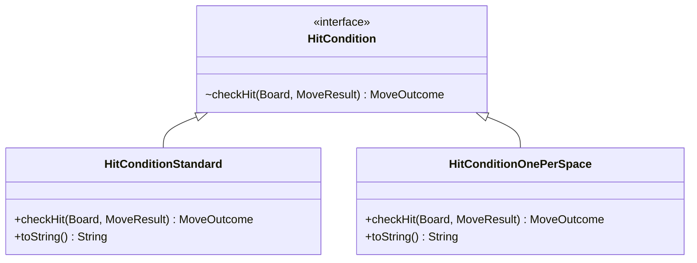
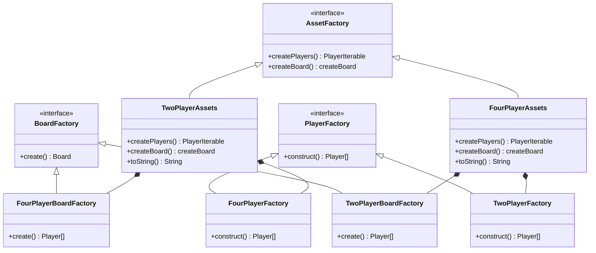
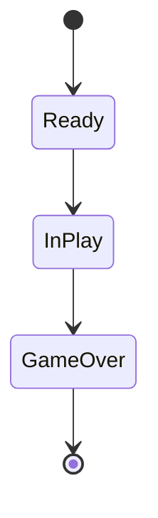
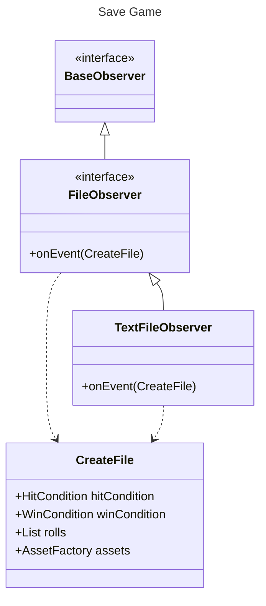

Frustration Game
=================
***Software Design And Architecture***

**Author:** *Luke Cadman*

I am Going to Caveat this by stating i am NOT going to be doing complete UML diagrams for any OOP 
principles. Other than Inheritance and others in certain cases because otherwise it becomes ugly and the UML diagrams start to 
mean less; just become a mess of lines and are harder to interpret.

# Dice Variation



For my Random Single and double dice implementation I have Use Decorators and the null object pattern as show in lab
exercises. so the implementation is practically the same for the NonRandom Dice class i have used a roll type Value 
Object as validation for inputted rolls
```java
package uk.ac.mmu.game.applicationcode.domain.dice.Types;

import java.util.Objects;

public class RollValue {

  static final int NONE = 0;
  final private int rollValue;

  private RollValue(int rollValue) {
    if ((rollValue < 1) || (rollValue > 12)) {
      throw new IllegalArgumentException("Roll value must be between 1 and 12");
    }
    this.rollValue = rollValue;
  }

  public static RollValue of(int value) {
    return new RollValue(value);
  }
}

```

This allows for input if just an array of integers to be used as predefined rolls

---------------
# Hit Variation


Hit Conditions have been managed using the strategy pattern to allow for runtime configuration of code based on the
strategy required.

To simplify response from its strategies previously I used a return if a string to understand if an item was hit or 
you've overshot. I replaced these with a Move outcome abstract class to do actions based of the outcome and also 
understand if an outcome is blocking e.g. ending a users turn the base class is below.

```java
public abstract class MoveOutcome {

  protected boolean endsTurn = false;
  protected boolean endsGame = false;

  public boolean endsTurn() {
    return endsTurn;
  }

  public boolean endsGame() {
    return endsGame;
  }

  public abstract void apply(GameStateInPlay ctx, MoveResult result);
}
```
This allows for a very streamlined main game loop. and simplifies this compared to the string used previously.

---------------
# Win Variation


The Design of this is almost identical to Hit variation using strategy but retuning a different outcome.

However, For both win and hit condition i use commands to easily undo if a move result would result in an illegal move
```java
package uk.ac.mmu.game.applicationcode.domain.entities;

public interface Command {

  MoveResult execute();

  void undo();
}

```


These Commands have knowledge of the previous move, so they can undo if a move is invalid allowing for Move outcomes to
be able to undo actions based on there validation. These are also stored in a stack so historic moves are stored and 
items can be popped if they need to be undone.

As well i have Overridden the toString method in most variations in
order to allow for accurate printing of the configuration to the console


---------------
# 4 Player Variation


For the Creation of Player and Board Objects I have used something similar to abstract factory pattern.
Why i say something similar is because it's not exactly the same as i return two factories however the board factories 
are more concrete implementations for configuring the boards not factories. The reason I did this as board design and
Player Numbers are Dependent on each other so i thought it would be a good place to use it.


I've Used the base iterator interface to create an iterator for the mane game loop to go through players to allow for a 
nicer game loop as well this is dependent on game state so as soon as game state in is Game Over it will stop looping


I've remove Iterator to make the UML simpler

---------------
# State Machine


This is an incredible simple State Machine to manage States in th Game How the responsibility are split


Game Ready -> Game Configuration 
In Play -> Main Game Loop
Game Over -> Saving game result to file


```java
public interface GameState {

  void play();

  void next();

  void show();
}

```
All of my states implement the following interface so in my main game all that is called is game.play()
then states move by themselves and each part is handed individually in the play mechanic

```java
  @Override
  public void play() {
    Dice die = game.getDice();
    Board board = game.getBoard();

    for (Player player : game.getPlayersList()) {
      incrementTurn(player);

      MoveResult result = rollAndMove(player, die, board);

      MoveOutcome hitOutcome = hitCondition.checkHit(board, result);
      if (applyOutcome(hitOutcome, result)) {
        continue;
      }

      MoveOutcome winOutcome = winCondition.checkWin(board, result);
      applyOutcome(winOutcome, result);

      if (winOutcome != null && winOutcome.endsGame()) {
        this.next();
      }
    }

  }
```
This is the main Game loop made simple due to all the previous implementations mentioned. i have use strategy for 
each state

---------------
# Game Save and Replay


For Saving I have used the observer pattern to pass to Details into the file as the pub sub model fills this need very
well. As well all my observes extend a base observer this is to allow for all observers to be stored in a single list
making attributes simpler for the game.


For Saving Game i have used Java generator to create UUID for game to make sure they are unique.
I also save types and roll instead of input to allow for the game creator to change the game with the same input to 
allow for testing of different games rules and see how it play which i think is better than coping to the console as
it seems quite pointless


Also I have use Payloads for all my events to allow for method overloading


# Load Game


loading Game used GameConfigfactory to relate the printed string to the values stored in text.


---------------
# SOLID Principles

I have used interface segregation for the game class so the provided interfaces to only allow access to the play method
as that's all that's required for the interface. As well my classes adhere with LSP and SRP I used the Move outcomes to 
improve SRP and LSP to adhere to SOLID principles

--------------
# Architecture

For configs i have split each into different configs for each game and they run in serial so they can be viewed
in the console in order.  


My Game is split into Domain UseCase and Infra and Infra contains all my Observers my use cases are PLay normal and Play
historic. the Domain contains all game specific code 

--------------
# Other Implementation

I have also Implemented Mediator, request response pattern and Unit tests for the roll values class