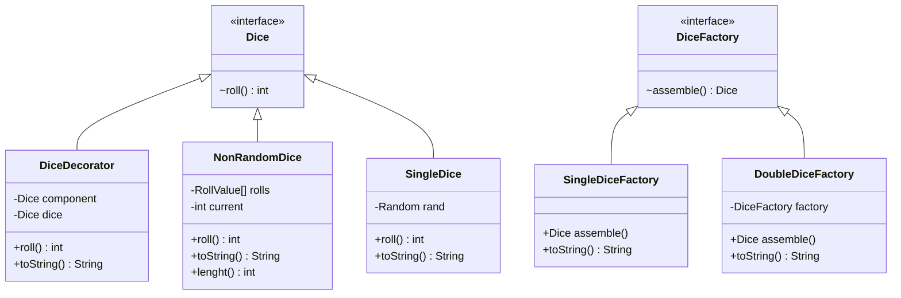
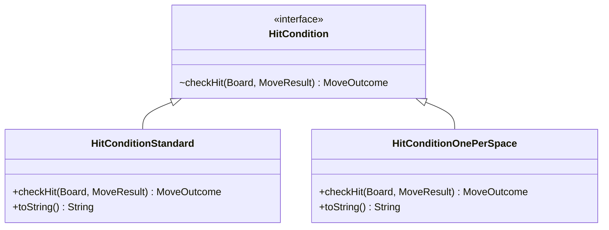

Frustration Game
=================
***Software Design And Architecture***

**Author:** *Luke Cadman*
# Dice Variation

Dice Variations talk about value object and null pattern

---------------
# Hit Variation

---------------
Win variation
Player
State Machine
File Output
Solid
Ports and A
Implemntation
