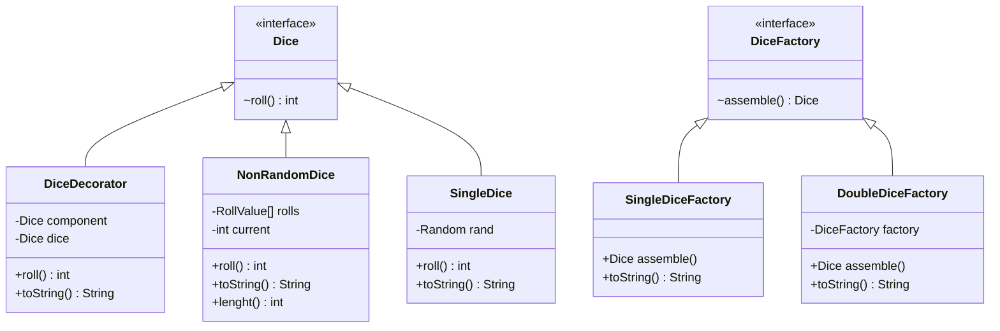
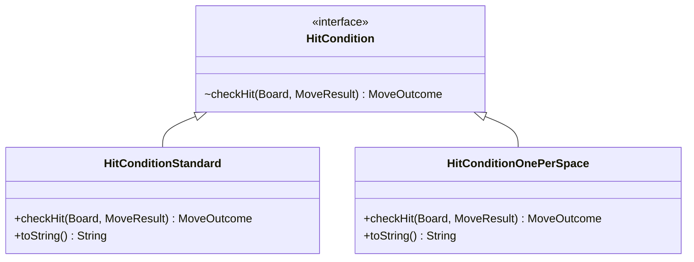
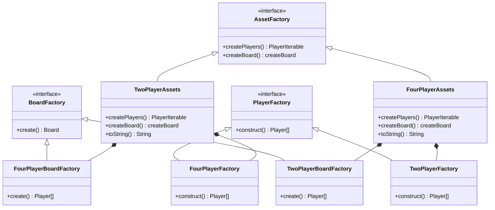
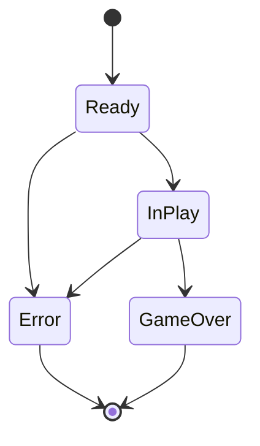
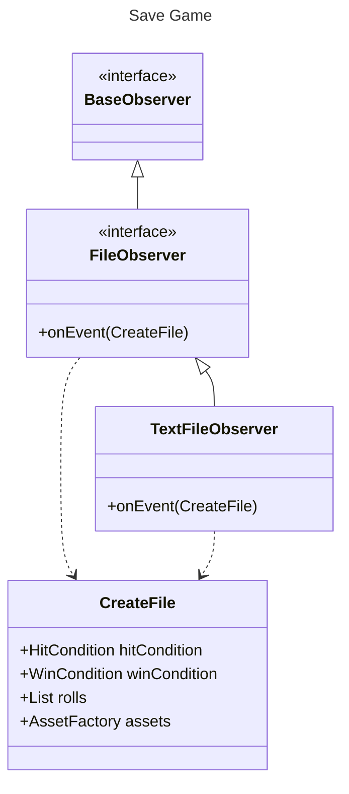

Frustration Game
=================
***Software Design And Architecture***

**Author:** *Luke Cadman*

I am Going to Caveat this by stating i am NOT going to be doing complete UML diagrams for any OOP 
principles. Other than Inheritance and others in certain cases because otherwise it becomes ugly and the UML diagrams start to 
mean less; just become a mess of lines and are harder to interpret.

# Dice Variation



For my Random Single and double dice implementation I have Use Decorators and the null object pattern as show in lab
exercises. so the implementation is practically the same for the NonRandom Dice class i have used a roll type Value 
Object as validation for inputted rolls
```java
package uk.ac.mmu.game.applicationcode.domain.dice.Types;

import java.util.Objects;

public class RollValue {

  static final int NONE = 0;
  final private int rollValue;

  private RollValue(int rollValue) {
    if ((rollValue < 1) || (rollValue > 12)) {
      throw new IllegalArgumentException("Roll value must be between 1 and 12");
    }
    this.rollValue = rollValue;
  }

  public static RollValue of(int value) {
    return new RollValue(value);
  }
}

```

This allows for input if just an array of integers to be used as predefined rolls

---------------
# Hit Variation


Hit Conditions have been managed using the strategy pattern to allow for runtime configuration of code based on the
strategy required.

To simplify response from its strategies previously I used a return if a string to understand if an item was hit or 
you've overshot. I replaced these with a Move outcome abstract class to do actions based of the outcome and also 
understand if an outcome is blocking e.g. ending a users turn the base class is below.

```java
public abstract class MoveOutcome {

  protected boolean endsTurn = false;
  protected boolean endsGame = false;

  public boolean endsTurn() {
    return endsTurn;
  }

  public boolean endsGame() {
    return endsGame;
  }

  public abstract void apply(GameStateInPlay ctx, MoveResult result);
}
```
This allows for a very streamlined main game loop. and simplifies this compared to the string used previously.

---------------
# Win Variation


The Design of this is almost identical to Hit variation using strategy but retuning a different outcome.

However, For both win and hit condition i use commands to easily undo if a move result would result in an illegal move
```java
package uk.ac.mmu.game.applicationcode.domain.entities;

public interface Command {

  MoveResult execute();

  void undo();
}

```


These Commands have knowledge of the previous move, so they can undo if a move is invalid allowing for Move outcomes to
be able to undo actions based on there validation. These are also stored in a stack so historic moves are stored and 
items can be popped if they need to be undone.

As well i have Overridden the toString method in most variations in
order to allow for accurate printing of the configuration to the console


---------------
# 4 Player Variation


Trying to find somewhere to put an abstract factory as these depedned on each other worked well
Use of iterator as well in main game loop to allow for cleaner rotation of player which is more expandabkle in future SRP
removed iterator for graph simplicity

---------------
# State Machine


talk about how different states manage different exit conditions etc and how state manages 
what can happen e.g game lkoop e.g file

---------------
# Game Save and Replay


Explain why Base observer
why txt how uuid why save types and roll not all values then print to console
Use of payloads in all observers


# Load Game


Blah Blah Blah


---------------
Solid
Ports and A
Implemntation
